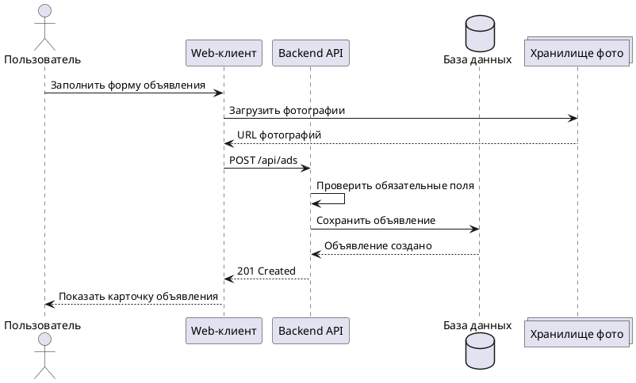

## Назначение

Sequence диаграмма фиксирует последовательность действий при создании объявления Lost&Found.

## Исходная диаграмма

## PlantUML-шаблон

```plantuml Sequence: создание объявления
@startuml
actor "Пользователь" as User
participant "Web-клиент" as Web
participant "Backend API" as Backend
database "База данных" as DB
collections "Хранилище фото" as Storage

User -> Web: Заполнить форму объявления
Web -> Storage: Загрузить фотографии
Storage --> Web: URL фотографий
Web -> Backend: POST /api/ads
Backend -> Backend: Проверить обязательные поля
Backend -> DB: Сохранить объявление
DB --> Backend: Объявление создано
Backend --> Web: 201 Created
Web --> User: Показать карточку объявления
@enduml
```
