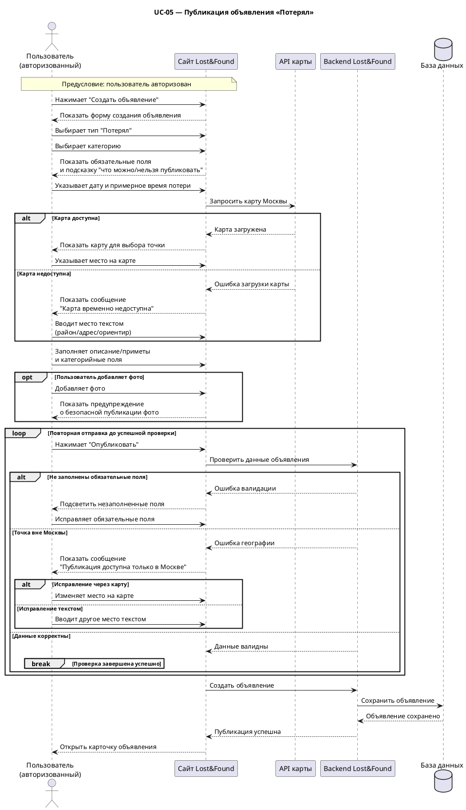

## Назначение

Диаграмма фиксирует основной сценарий UC-05: публикацию объявления «Потерял» авторизованным пользователем.

## Исходная диаграмма

## UC-05 — публикация объявления «Потерял»

```plantuml UC-05 — публикация объявления «Потерял»
@startuml
title UC-05 — Публикация объявления «Потерял»

actor "Пользователь\n(авторизованный)" as User
participant "Сайт Lost&Found" as Web
participant "API карты" as MapApi
participant "Backend Lost&Found" as Backend
database "База данных" as DB

note over User, Web
Предусловие: пользователь авторизован
end note

User -> Web: Нажимает "Создать объявление"
Web --> User: Показать форму создания объявления
User -> Web: Выбирает тип "Потерял"
User -> Web: Выбирает категорию
Web --> User: Показать обязательные поля\nи подсказку "что можно/нельзя публиковать"
User -> Web: Указывает дату и примерное время потери
Web -> MapApi: Запросить карту Москвы

alt Карта доступна
  MapApi --> Web: Карта загружена
  Web --> User: Показать карту для выбора точки
  User -> Web: Указывает место на карте
else Карта недоступна
  MapApi --> Web: Ошибка загрузки карты
  Web --> User: Показать сообщение\n"Карта временно недоступна"
  User -> Web: Вводит место текстом\n(район/адрес/ориентир)
end

User -> Web: Заполняет описание/приметы\nи категорийные поля

opt Пользователь добавляет фото
  User -> Web: Добавляет фото
  Web --> User: Показать предупреждение\nо безопасной публикации фото
end

loop Повторная отправка до успешной проверки
  User -> Web: Нажимает "Опубликовать"
  Web -> Backend: Проверить данные объявления

  alt Не заполнены обязательные поля
    Backend --> Web: Ошибка валидации
    Web --> User: Подсветить незаполненные поля
    User -> Web: Исправляет обязательные поля
  else Точка вне Москвы
    Backend --> Web: Ошибка географии
    Web --> User: Показать сообщение\n"Публикация доступна только в Москве"

    alt Исправление через карту
      User -> Web: Изменяет место на карте
    else Исправление текстом
      User -> Web: Вводит другое место текстом
    end
  else Данные корректны
    Backend --> Web: Данные валидны
    break Проверка завершена успешно
    end
  end
end

Web -> Backend: Создать объявление
Backend -> DB: Сохранить объявление
DB --> Backend: Объявление сохранено
Backend --> Web: Публикация успешна
Web --> User: Открыть карточку объявления
@enduml
```
