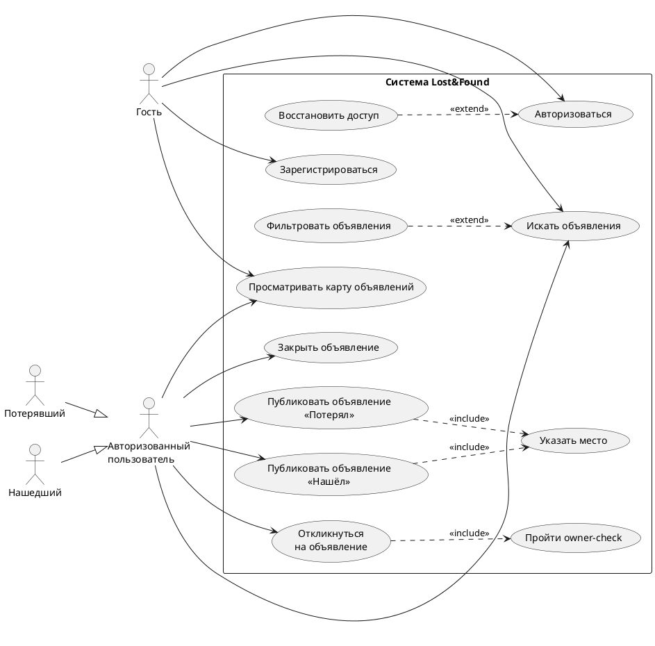

## Назначение

Диаграмма показывает роли пользователей и основные сценарии работы с системой Lost&Found.

## Use Case диаграмма

```plantuml Use Case Lost&Found
@startuml
left to right direction
skinparam packageStyle rectangle

actor "Гость" as Guest
actor "Авторизованный\nпользователь" as AuthUser
actor "Потерявший" as Owner
actor "Нашедший" as Finder

Owner --|> AuthUser
Finder --|> AuthUser

rectangle "Система Lost&Found" {
  usecase "Авторизоваться" as Login
  usecase "Восстановить доступ" as Restore
  usecase "Зарегистрироваться" as Register
  usecase "Просматривать карту объявлений" as Map
  usecase "Искать объявления" as Search
  usecase "Фильтровать объявления" as Filter
  usecase "Публиковать объявление\n«Потерял»" as PublishLost
  usecase "Публиковать объявление\n«Нашёл»" as PublishFound
  usecase "Указать место" as SetPlace
  usecase "Откликнуться\nна объявление" as Respond
  usecase "Пройти owner-check" as OwnerCheck
  usecase "Закрыть объявление" as CloseAd
}

Guest --> Login
Guest --> Register
Guest --> Map
Guest --> Search

AuthUser --> Map
AuthUser --> Search
AuthUser --> PublishLost
AuthUser --> PublishFound
AuthUser --> Respond
AuthUser --> CloseAd

Restore ..> Login : <<extend>>
Filter ..> Search : <<extend>>
PublishLost ..> SetPlace : <<include>>
PublishFound ..> SetPlace : <<include>>
Respond ..> OwnerCheck : <<include>>
@enduml
```
