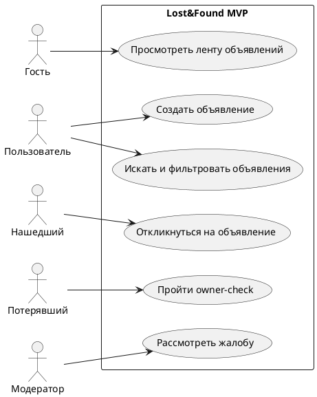

## Назначение

Use Case диаграмма показывает основные сценарии взаимодействия пользователей и модератора с системой Lost&Found.

## Исходная диаграмма

## PlantUML-шаблон

```plantuml Use Case Lost&Found
@startuml
left to right direction
actor "Гость" as Guest
actor "Пользователь" as User
actor "Нашедший" as Finder
actor "Потерявший" as Owner
actor "Модератор" as Moderator
rectangle "Lost&Found MVP" {
  Guest --> (Просмотреть ленту объявлений)
  User --> (Создать объявление)
  User --> (Искать и фильтровать объявления)
  Finder --> (Откликнуться на объявление)
  Owner --> (Пройти owner-check)
  Moderator --> (Рассмотреть жалобу)
}
@enduml
```
